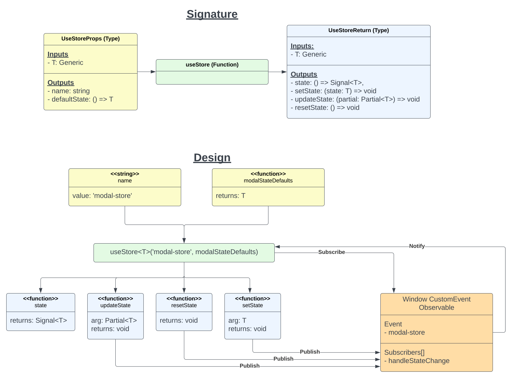

# What is Fluxy?

Fluxy is a very simple store that allows Deno Fresh islands to communicate using
hooks.

# Examples

Take a look at the following files in
[this](https://github.com/woody34/fluxy-fresh) repo for implementation
reference.

```sh
├── hooks
│   └── useToaster.ts
├── islands
│   ├── ShowToastButton.tsx
│   └── Toast.tsx
└── routes
    └── _app.tsx
```

[Code Sandbox](https://codesandbox.io/p/github/woody34/fluxy-fresh/main?import=true&layout=%257B%2522sidebarPanel%2522%253A%2522GIT%2522%252C%2522rootPanelGroup%2522%253A%257B%2522direction%2522%253A%2522horizontal%2522%252C%2522contentType%2522%253A%2522UNKNOWN%2522%252C%2522type%2522%253A%2522PANEL_GROUP%2522%252C%2522id%2522%253A%2522ROOT_LAYOUT%2522%252C%2522panels%2522%253A%255B%257B%2522type%2522%253A%2522PANEL_GROUP%2522%252C%2522contentType%2522%253A%2522UNKNOWN%2522%252C%2522direction%2522%253A%2522vertical%2522%252C%2522id%2522%253A%2522clp9bek5n00073b6isci6hrun%2522%252C%2522sizes%2522%253A%255B70%252C30%255D%252C%2522panels%2522%253A%255B%257B%2522type%2522%253A%2522PANEL_GROUP%2522%252C%2522contentType%2522%253A%2522EDITOR%2522%252C%2522direction%2522%253A%2522horizontal%2522%252C%2522id%2522%253A%2522EDITOR%2522%252C%2522panels%2522%253A%255B%257B%2522type%2522%253A%2522PANEL%2522%252C%2522contentType%2522%253A%2522EDITOR%2522%252C%2522id%2522%253A%2522clp9bek5n00033b6iod4uzhc3%2522%257D%255D%257D%252C%257B%2522type%2522%253A%2522PANEL_GROUP%2522%252C%2522contentType%2522%253A%2522SHELLS%2522%252C%2522direction%2522%253A%2522horizontal%2522%252C%2522id%2522%253A%2522SHELLS%2522%252C%2522panels%2522%253A%255B%257B%2522type%2522%253A%2522PANEL%2522%252C%2522contentType%2522%253A%2522SHELLS%2522%252C%2522id%2522%253A%2522clp9bek5n00053b6icx0pk795%2522%257D%255D%252C%2522sizes%2522%253A%255B100%255D%257D%255D%257D%252C%257B%2522type%2522%253A%2522PANEL_GROUP%2522%252C%2522contentType%2522%253A%2522DEVTOOLS%2522%252C%2522direction%2522%253A%2522vertical%2522%252C%2522id%2522%253A%2522DEVTOOLS%2522%252C%2522panels%2522%253A%255B%257B%2522type%2522%253A%2522PANEL%2522%252C%2522contentType%2522%253A%2522DEVTOOLS%2522%252C%2522id%2522%253A%2522clp9bek5n00063b6iwy9fdqqq%2522%257D%255D%252C%2522sizes%2522%253A%255B100%255D%257D%255D%252C%2522sizes%2522%253A%255B60%252C40%255D%257D%252C%2522tabbedPanels%2522%253A%257B%2522clp9bek5n00033b6iod4uzhc3%2522%253A%257B%2522id%2522%253A%2522clp9bek5n00033b6iod4uzhc3%2522%252C%2522tabs%2522%253A%255B%255D%257D%252C%2522clp9bek5n00063b6iwy9fdqqq%2522%253A%257B%2522id%2522%253A%2522clp9bek5n00063b6iwy9fdqqq%2522%252C%2522activeTabId%2522%253A%2522clp9bu9rq02bv3b6i7oxxs12d%2522%252C%2522tabs%2522%253A%255B%257B%2522type%2522%253A%2522TASK_PORT%2522%252C%2522taskId%2522%253A%2522deno%2520task%2520start%2522%252C%2522port%2522%253A8000%252C%2522id%2522%253A%2522clp9bu9rq02bv3b6i7oxxs12d%2522%252C%2522mode%2522%253A%2522permanent%2522%252C%2522path%2522%253A%2522%252F%2522%257D%255D%257D%252C%2522clp9bek5n00053b6icx0pk795%2522%253A%257B%2522id%2522%253A%2522clp9bek5n00053b6icx0pk795%2522%252C%2522tabs%2522%253A%255B%257B%2522id%2522%253A%2522clp9bek5n00043b6ie1rakkcl%2522%252C%2522mode%2522%253A%2522permanent%2522%252C%2522type%2522%253A%2522TERMINAL%2522%252C%2522shellId%2522%253A%2522clp9bek86000wegi8ggcc7xkn%2522%257D%252C%257B%2522type%2522%253A%2522TASK_LOG%2522%252C%2522taskId%2522%253A%2522CSB_RUN_OUTSIDE_CONTAINER%253D1%2520devcontainer%2520templates%2520apply%2520--template-id%2520%255C%2522ghcr.io%252Fdevcontainers%252Ftemplates%252Ftypescript-node%255C%2522%2520--template-args%2520%27%257B%257D%27%2520--features%2520%27%255B%255D%27%2522%252C%2522id%2522%253A%2522clp9bf0ng007d3b6ibtvaurxb%2522%252C%2522mode%2522%253A%2522permanent%2522%257D%252C%257B%2522type%2522%253A%2522TASK_LOG%2522%252C%2522taskId%2522%253A%2522deno%2520task%2520start%2522%252C%2522id%2522%253A%2522clp9bh16p00ii3b6i1s3pjmaa%2522%252C%2522mode%2522%253A%2522permanent%2522%257D%255D%252C%2522activeTabId%2522%253A%2522clp9bh16p00ii3b6i1s3pjmaa%2522%257D%257D%252C%2522showDevtools%2522%253Atrue%252C%2522showShells%2522%253Atrue%252C%2522showSidebar%2522%253Atrue%252C%2522sidebarPanelSize%2522%253A15%257D)

# Demo

[Live Demo](https://fluxy-fresh.deno.dev/)

# Design Docs

<div style="text-align: center;">
  
</div>
